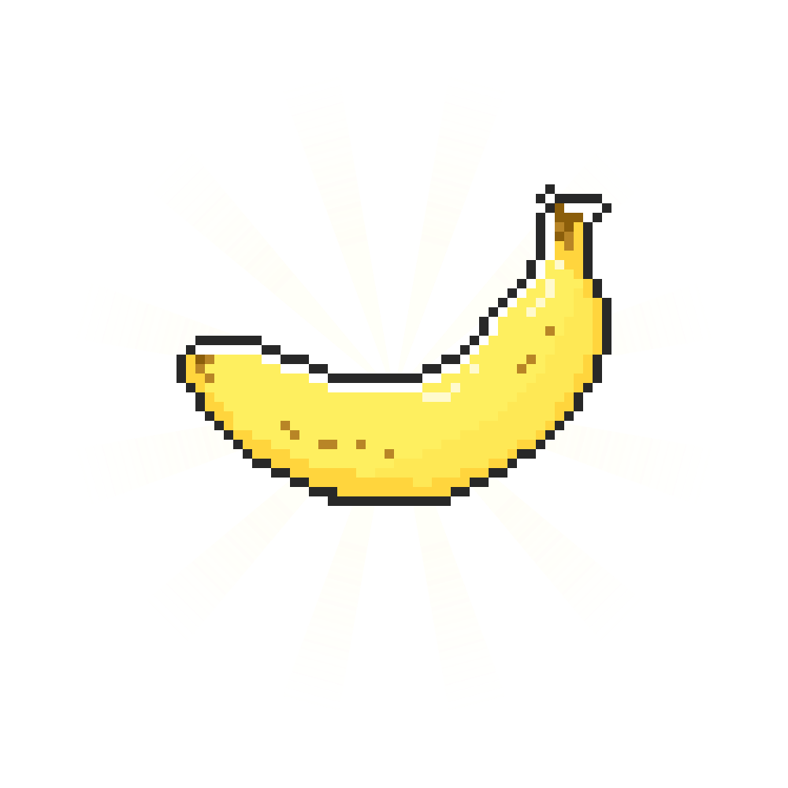

---

# 0xDearBanana 0.1 (WIP)

0xDearBanana is a graphical application that enables dynamic instrumentation of processes using Frida. With its interface built on [imgui_bundle](https://github.com/pthom/imgui_bundle), the tool provides visual hook management, JavaScript script injection, event logging, and many other features useful for analyzing and modifying application behavior in real time.

## Table of Contents

- [Features](#features)
- [Depedencies](#depedencies)
- [Installation](#installation)
- [Usage](#usage)
- [Project Architecture](#project-architecture)
- [Testing and Automation Scripts](#testing-and-automation-scripts)
- [Contributing](#contributing)
- [License](#license)
- [Acknowledgements](#acknowledgements)

## Features

- **Dynamic Process Hooking with Frida**  
  Attach to a local process and intercept function calls (e.g., *CreateFileW*, *ReadFile*, *WriteFile*) to analyze or modify behavior.

- **Integrated Graphical Interface**  
  Manage hooks visually via a GUI that offers:
  - Active hook management (start/stop hooks, view trigger counts, etc.)
  - A JavaScript editor for customizing the injection scripts.
  - Specialized windows such as a Frida console, hex viewer, and disassembler.

- **Command Palette**  
  Quickly execute commands such as adding a hook, toggling various windows, changing the theme, or saving/loading your project using an interactive command palette.

- **Project Save and Load**  
  Save your current project state (hooks, logs, etc.) to a JSON file and reload it later for continued analysis.

## Depedencies

- **Python 3.10+**
- **Frida**  
- **imgui_bundle**  
- **pyperclip**  
- **Capstone** *(optional)*  
- **Pygments** *(optional)*  

## Installation

**Install the Dependencies:**

   ```bash
   pip install -r requirements.txt
   ```

On linux, to be able to install imgui_bundle before the previous command run :

```bash
sudo apt-get install libgl1-mesa-dev libglu1-mesa-dev 
```

At run time if the application produce a segfault (specifically on Windows trough WSL):
```bash
export LIBGL_ALWAYS_SOFTWARE=1
```

## Usage

### Starting the Application

Run the application using:

```bash
python __init__.py
```

This will launch the graphical interface in a window titled **"0xDearBanana"**.

### Graphical Interface

The application is divided into several modules accessible from the main window:

- **Hooks Management**  
  View and manage active hooks, start/stop hooks, and see statistics (trigger counts, logs, etc.).

- **Frida Console**  
  Execute custom JavaScript code within the context of an attached process.

- **Global Logs**  
  Monitor and filter log events generated by hooks in a structured table view.

- **Disassembly & Hex Viewer**  
  Explore a process's memory through disassembled code and hexadecimal dumps (advanced analysis; requires Capstone and Pygments).

### Command Palette

The command palette allows quick execution of various actions:
- **Add a Hook**
- **Toggle Windows** (e.g., console, logs)
- **Change Theme**
- **Save/Load Project**
- **Access Testing Commands**

Use the keyboard shortcut *Ctrl+P* to open the palette, type the desired command, and press *Enter* to execute.

### Project Save/Load

- **Saving a Project:**  
  Use the "Save Project" command to export the current state (hooks, logs, etc.) to a JSON file (default filename is `project.json`).

- **Loading a Project:**  
  Use the "Load Project" command to restore a previously saved project.

## Project Architecture

The project is organized into several modules:

- **app.py**  
  Contains the main class *FridaHookManagerApp* which initializes the GUI, manages processes, and orchestrates interactions.

- **api.py / script_api.py**  
  Provide a simplified interface to interact with the application programmatically or via interactive Python shells (IPython or Jupyter Notebook).

- **hooking_window.py & hook_window_manager.py**  
  Manage hook creation and lifecycle, including process attachment, script injection via Frida, and event handling.

- **frida_interaction.py**  
  Interfaces with Frida to fetch the list of processes, modules, and exported functions.

- **Command Palette & Manager**  
  (command_palette.py, command_palettes_manager.py) Enable the execution of commands through an interactive palette interface.

- **Display Windows**  
  (disasviewer_window.py, hexviewer_window.py, frida_console_window.py, global_logs_window.py) Provide specialized views for memory analysis and log monitoring.

- **Loggers and Widgets**  
  (logger_widgets.py) Handle text and table logging for hook events.

- **Project Manager**  
  (project_manager.py) Supports saving and loading the project configuration.

- **Utilities and Themes**  
  (utils.py, themes.py) Offer utility functions and customizable themes for the interface.

## Testing and Automation Scripts

The module *tests_add_hooks.py* contains routines to simulate adding hooks via the command palette. These automated tests can be run from within the interface or interactively to validate the hook chain process.

## License

TBD

## Acknowledgements

- [Frida](https://frida.re/) for dynamic instrumentation.
- [imgui_bundle](https://github.com/pthom/imgui_bundle) for providing the graphical interface framework.
- Thanks to all the open source creators for their incredible work.

---


## TODO
- Fill this TODO